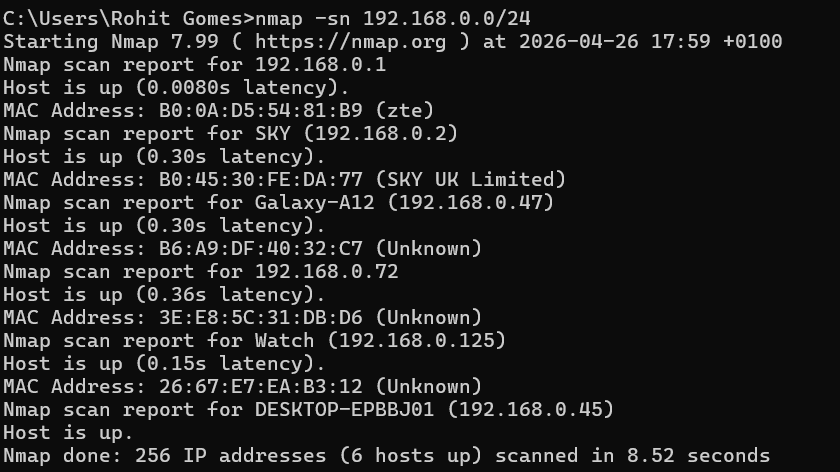
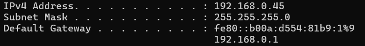
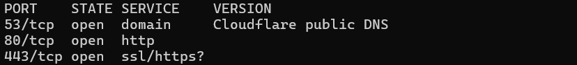

# Home Network Scan Project

## Objective
To discover and analyse devices on my home network using Nmap.

## Tools Used
- Nmap
- Command Prompt

## Commands Used
ipconfig  
nmap -sn 192.168.0.0/24  

## Findings
- Total devices found: 6

### Devices identified:
- Router: 192.168.0.1 (ZTE)
- ISP Device: 192.168.0.2 (SKY UK)
- My PC: 192.168.0.45
- Phone: Galaxy A12 (192.168.0.47)
- Watch: 192.168.0.125

### Unknown device:
- 192.168.0.72 (Unidentified)

## Analysis
Most devices were recognised on the network.  
One unknown device was detected, which could be a household device such as a TV or tablet.  

## What I Learned
- How to scan a network using Nmap
- How to identify devices using IP and MAC addresses
- Importance of checking unknown devices on a network

## Next Steps
- Perform deeper scan using nmap -sV
- Learn more about open ports and services

## Screenshots

